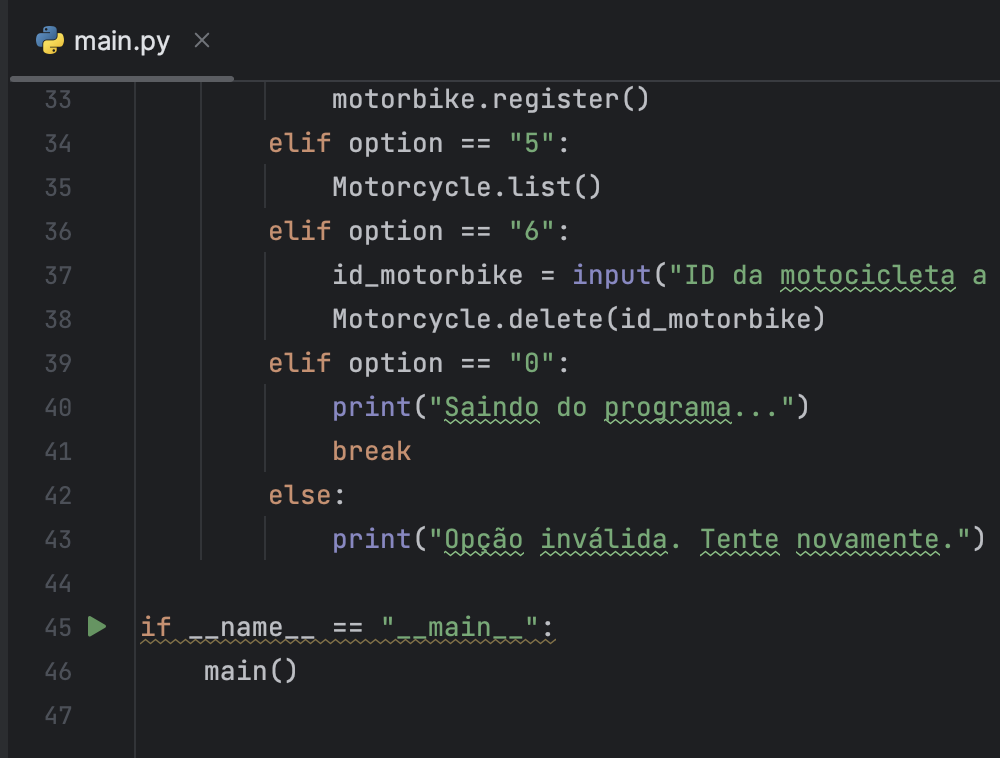
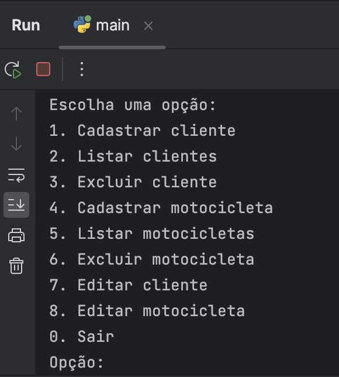
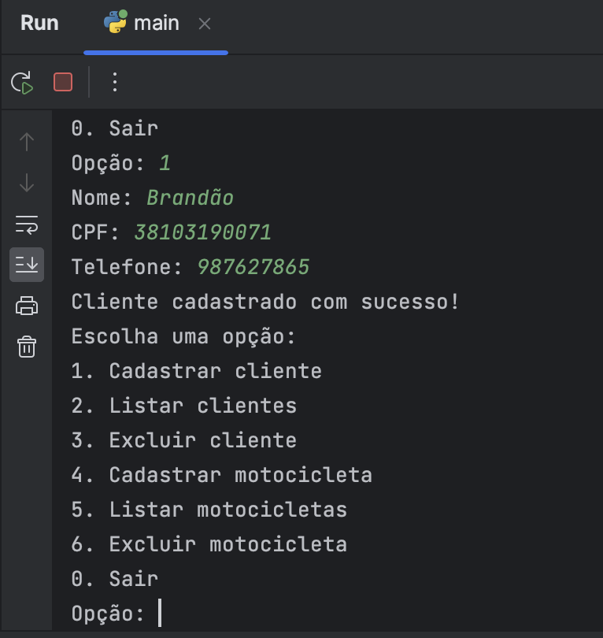
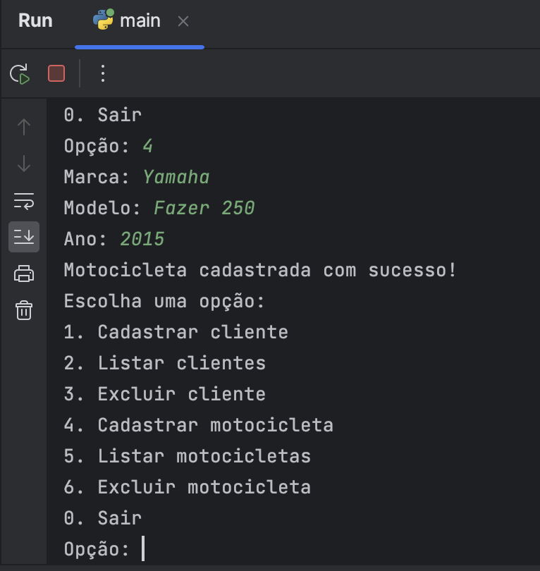
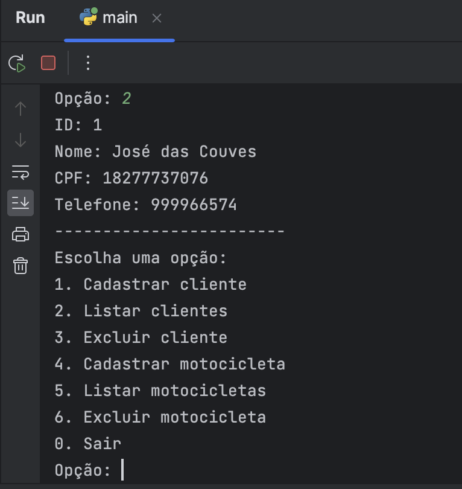
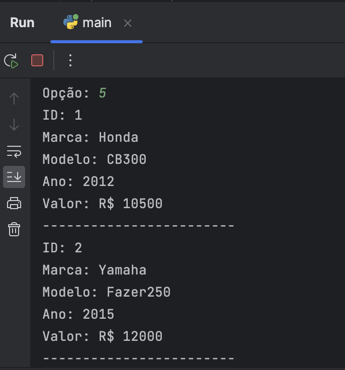
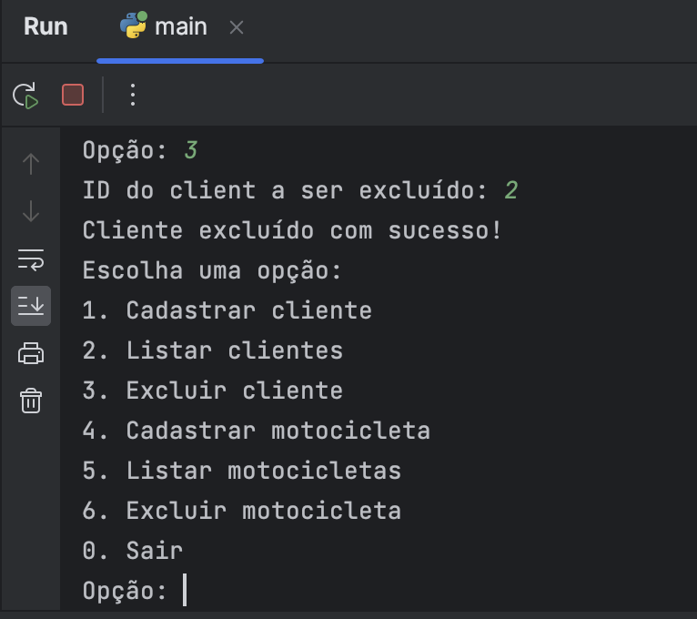
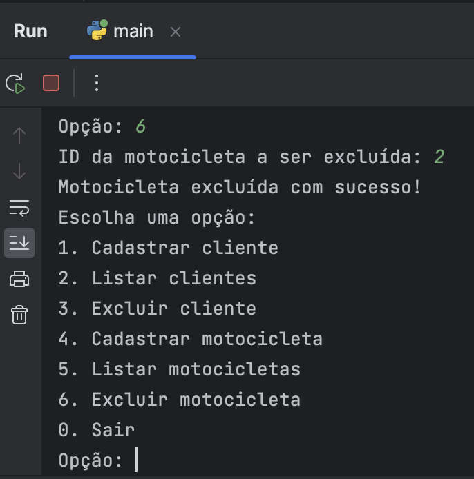
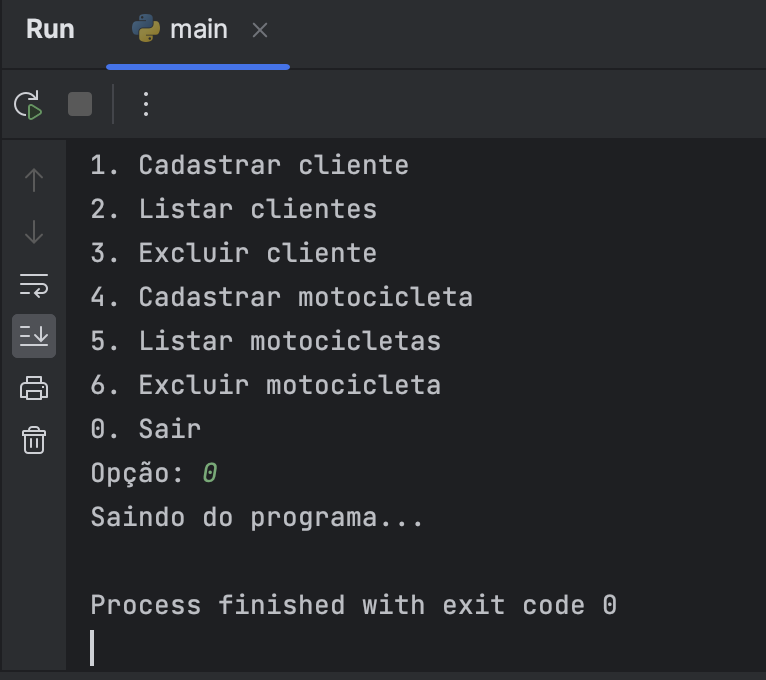

# Dealership (Concessionária)

AP2 seria uma criação de uma aplicação para uma Concessionária de Motocicleta.
Para isso foi preciso fazer o CRUD das Motocicletas e dos Clientes.

## A aplicação funciona da seguinte forma:

- Estamos usando o SQlite3 Para criar um banco de dados virtual para o projeto, pois é 
um banco de dados leve que pode ser usado localmente sem a necessidade de configuração de servidor.

## Inciar aplicação
Agora vc pode rodar a aplicação, no arquivo `main.py` na linha 45.
tem um simbolo de play na cor verde onde ao clicar inicia a aplicação.
Como mostra a imagem abaixo:

Após isso, no terminal vai aparecer as opções para o usuário ir respondendo de acordo com sua necessidade.

Abaixo segue imagens do que pode ser feito na aplicação:

- Menu Principal:

- Cadastro de Cliente:

- Cadastro de Motocicleta:

- Listar Cliente:

- Listar Motocicleta:

- Excluir Cliente:

- Excluir Motocicleta:

- Encerrar Programa:

